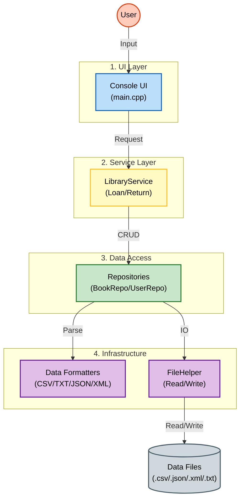

# HỆ THỐNG QUẢN LÝ THƯ VIỆN (LIBRARY MANAGEMENT SYSTEM)

**Thông tin dự án:**

- **Sinh viên:** Nguyễn Ngọc Quang
- **Lớp:** 24CTT5 - Bộ môn Lập trình hướng đối tượng.
- **Ngôn ngữ:** C++ (Standard 17).
- **Công cụ build:** CMake.
- **Mục tiêu:** Xây dựng hệ thống quản lý sách và người dùng, hỗ trợ đa định dạng dữ liệu (CSV, JSON, XML, TXT) và xử lý nghiệp vụ thư viện.

## 1. Cấu Trúc Dự Án (Project Structure)

Dưới đây là sơ đồ tổ chức mã nguồn của dự án:

```text
LibrarySystem/
├── CMakeLists.txt              # Cấu hình build cho toàn bộ dự án
├── README.md                   # Tài liệu hướng dẫn
├── main.cpp                    # Điểm khởi chạy ứng dụng (UI/Console)
├── data/                       # Chứa cơ sở dữ liệu (File)
│   ├── books.csv
│   ├── books.json
│   ├── books.xml
│   ├── books.txt
│   ├── users.csv
│   ├── users.txt
│   └── ...
├── src/                        # Mã nguồn chính
│   ├── core/                   # Các thực thể cơ bản (Entities)
│   │   ├── Book.h              # Đối tượng Sách
│   │   ├── User.h              # Đối tượng Người dùng
│   │   ├── LoanTicket.h        # Đối tượng Vé mượn (chi tiết mượn trả)
│   │   └── Object.h            # Lớp cha (Base class)
│   │
│   ├── repositories/           # Tầng truy xuất dữ liệu (Thủ kho)
│   │   ├── BookRepository.h    # Quản lý kho sách
│   │   ├── UserRepository.h    # Quản lý hồ sơ người dùng
│   │   │
│   │   ├── DataFormatters/     # Các bộ dịch mã đa định dạng
│   │   │   ├── IDataFormatter.h    # Interface chung
│   │   │   ├── FormatterFactory.h  # Nhà máy sản xuất Formatter
│   │   │   ├── CsvFormatter.h/.cpp
│   │   │   ├── JsonFormatter.h/.cpp
│   │   │   ├── XmlFormatter.h/.cpp
│   │   │   └── TxtFormatter.h/.cpp
│   │   │
│   │   └── Helpers/            # Các công cụ hỗ trợ (Tiện ích)
│   │       ├── FileHelper.h    # Đọc/Ghi file vật lý
│   │       ├── StringHelper.h  # Cắt chuỗi, xử lý văn bản
│   │       └── DateHelper.h    # Xử lý ngày tháng
│   │
│   └── services/               # Tầng nghiệp vụ (Quản lý)
│       └── LibraryService.h    # Xử lý logic mượn, trả, kiểm tra điều kiện
│
├── tests/                      # Kiểm thử tự động (Unit Tests)
│   ├── catch.hpp               # Thư viện Catch2
│   ├── TestMain.cpp            # Entry point cho test
│   └── TestCore.cpp            # Test các helper và logic cơ bản
│
└── build/                      # Thư mục chứa file biên dịch (Exe)
```

## 2. Câu chuyện & Lý thuyết (The Story & Theory)

Để hiểu cách hệ thống này vận hành, hãy hình dung Thư viện của chúng ta như một tổ chức với các nhân sự chuyên trách:

### 🏢 1. Ông Thủ Kho (Repository)

- **Vai trò:** Đây là người nắm giữ chìa khóa vào kho lưu trữ (`data/`).
- **Tính cách:** Ông ấy rất nguyên tắc. Ông ấy không quan tâm cuốn sách đó hay hay dở, người mượn là ai. Ông ấy chỉ biết: "Đưa tôi dữ liệu, tôi cất vào. Hỏi tôi ID số 1, tôi lấy ra".
- **Đại diện trong code:** `BookRepository`, `UserRepository`.

### 🗣️ 2. Anh Thông Dịch Viên (DataFormatter)

- **Vai trò:** Vì dữ liệu được gửi đến từ nhiều nguồn khác nhau (người Nhật dùng XML, người Mỹ dùng JSON, người Việt dùng CSV), ông Thủ Kho không thể hiểu hết được. Ông ấy thuê các anh thông dịch viên.
- **Tính cách:**
  - _Anh CSV:_ Chuyên cắt dữ liệu bằng dấu phẩy.
  - _Anh JSON:_ Chuyên xử lý các dấu ngoặc nhọn `{}`.
  - _Anh XML:_ Chuyên đọc các thẻ đóng mở `<tag>`.
  - _Anh TXT:_ Chuyên xử lý file text với dòng định dạng chuẩn.
- **Đại diện trong code:** `CsvFormatter`, `JsonFormatter`, `XmlFormatter`, `TxtFormatter` (Sử dụng mẫu thiết kế **Strategy Pattern** để thay đổi linh hoạt).

### 👮 3. Người Quản Lý (Service)

- **Vai trò:** Đây là "bộ não" của thư viện. Khi có khách muốn mượn sách, Lễ tân sẽ hỏi ý kiến người này.
- **Công việc:**
  1. Kiểm tra xem sách trong kho còn không? (Hỏi ông Thủ Kho).
  2. Kiểm tra xem khách này có đang mượn quá 5 cuốn không? (Kiểm tra hồ sơ).
  3. Nếu đủ điều kiện -> Ký lệnh xuất kho.
- **Đại diện trong code:** `LibraryService`.

### 🛠️ 4. Chú Lao Công Đa Năng (Helper)

- **Vai trò:** Làm những việc vặt nhưng quan trọng mà ai cũng cần nhờ đến.
- **Công việc:** Mở cửa kho (`FileHelper`), ghi chép ngày tháng (`DateHelper`), cắt dán giấy tờ (`StringHelper`).
- **Đại diện trong code:** Các class trong thư mục `Helpers`.

### 🔄 Luồng dữ liệu (Data Flow)

_(Lưu ý: cần cài đặt extension "Markdown Preview Mermaid Support" trên VS Code để xem biểu đồ này)_



## 3. Tính Năng Nổi Bật (Features)

- **Quản lý đa định dạng:** Hệ thống tự động nhận diện đuôi file (`.csv`, `.json`, `.xml`, `.txt`) để chọn bộ xử lý phù hợp. Không cần sửa code khi đổi định dạng lưu trữ.
- **Cơ chế ID tự động:** Tự động sinh ID mới (Auto-increment) khi thêm sách hoặc người dùng.
- **Quản lý mượn trả phức tạp:**
  - Lưu trữ lịch sử mượn dưới dạng danh sách vé (`LoanTicket`).
  - Dữ liệu mượn được nén gọn trong chuỗi format chuẩn (Ví dụ: `[BookID|Date|Days]`) để đảm bảo tính nhất quán giữa các file.
- **An toàn dữ liệu:** Sử dụng cơ chế ghi đè an toàn (`updateChange`), đảm bảo dữ liệu trong RAM và File luôn đồng bộ.

## 4. Hướng Dẫn Cài Đặt & Chạy (Build Instructions)

Dự án sử dụng **CMake** để biên dịch. Các bước thực hiện như sau:

### Chuẩn bị:

- Cài đặt trình biên dịch C++ (MinGW hoặc MSVC).
- Cài đặt CMake.

* Việc đường dẫn có kí tự lạ (hoặc đường dẫn có Tiếng Việt) có thể build lỗi

### Biên dịch:

Mở terminal tại thư mục gốc của dự án:

```bash
mkdir build
cd build
cmake -G "MinGW Makefiles" ..
cmake --build .
```

_(Lưu ý: Nếu dùng Visual Studio, bỏ qua tham số `-G`)_.

### Chạy ứng dụng:

- **Chạy chương trình chính:**
  ```bash
  ./LibraryApp.exe
  ```
- **Chạy kiểm thử (Unit Test):**
  ```bash
  ./RunTests.exe
  ```

## 5. Quy tắc OOP & Clean Code

Dự án này không chỉ chạy được, mà còn được thiết kế để "Dễ đọc - Dễ bảo trì - Dễ mở rộng" bằng cách áp dụng các nguyên lý hiện đại:

### 🛠 Design Patterns (Mẫu thiết kế)

1.  **Strategy Pattern (Chiến lược):**

    - **Vấn đề:** Cần hỗ trợ nhiều định dạng file (CSV, JSON, XML) mà không muốn sửa code của `BookRepository` mỗi khi thêm một định dạng mới.
    - **Giải pháp:** Tạo interface `IDataFormatter`. `BookRepository` chỉ giao tiếp với interface này. Các thuật toán xử lý file cụ thể (`CsvFormatter`, `JsonFormatter`) được đóng gói riêng biệt.

2.  **Factory Pattern (Nhà máy):**
    - **Vấn đề:** Làm sao để chương trình tự biết nên dùng `CsvFormatter` hay `JsonFormatter` dựa vào đuôi file?
    - **Giải pháp:** Class `FormatterFactory` nhận vào tên file và tự động sản xuất ra instance Formatter phù hợp.

### 📐 SOLID Principles

1.  **Single Responsibility Principle (SRP - Đơn nhiệm):**
    - Mọi class chỉ làm đúng một việc.
    - _Ví dụ:_ `UserMenu` chỉ lo hiển thị. `LibraryService` chỉ lo logic mượn trả. `BookRepository` chỉ lo đọc ghi file.
2.  **Dependency Inversion Principle (DIP - Đảo ngược phụ thuộc):**
    - Các module cấp cao không nên phụ thuộc vào module cấp thấp. Cả hai nên phụ thuộc vào Abstract.
    - _Chứng minh:_ `BookRepository` (cấp cao) không gọi trực tiếp `CsvFormatter` (cấp thấp). Thay vào đó, nó gọi `IDataFormatter` (Abstract/Interface). Nhờ vậy, ta có thể thay thế CSV bằng Database mà không ảnh hưởng logic kho.

### 🧪 Unit Testing

- Dự án áp dụng quy trình kiểm thử đơn vị với thư viện `Catch2`.
- Mỗi thay đổi logic đều được verify qua hàng loạt test case tự động (hơn 50 assertions) để đảm bảo không phát sinh lỗi tiềm ẩn.

## 6. Lời cảm ơn & Nguồn tham khảo (Acknowledgments)

Dự án này được hoàn thiện nhờ sự hỗ trợ từ các nguồn lực và công cụ sau:

- **Thư viện bên thứ ba:**

  - `catch.hpp` ([GitHub](https://github.com/catchorg/Catch2)): Framework kiểm thử đơn vị (Unit Testing) cho C++.
  - `nlohmann/json` ([GitHub](https://github.com/nlohmann/json)): Thư viện xử lý JSON.
  - `tinyxml2` ([GitHub](https://github.com/leethomason/tinyxml2)): Thư viện xử lý XML.

- **Trợ lý AI:**
  - **Gemini & Claude**: đóng vai trò gợi ý, đánh giá lộ trình, cấu trúc code và hỗ trợ:
    - Hướng dẫn viết Unit Test với Catch2, vẽ giao diện, viết README.md.
    - Gợi ý refactor code theo mô hình Service-Repository để tách biệt trách nhiệm.
    - Đánh giá architecture và đề xuất các giải pháp xử lý dữ liệu đa định dạng.
    - Hỗ trợ debug các lỗi linker và memory leak phức tạp.

Xin chân thành cảm ơn Thầy bộ môn Lập trình hướng đối tượng đã cung cấp nền tảng kiến thức vững chắc để thực hiện đồ án này.
